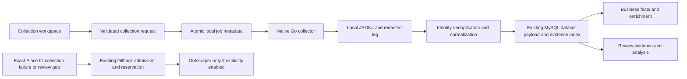
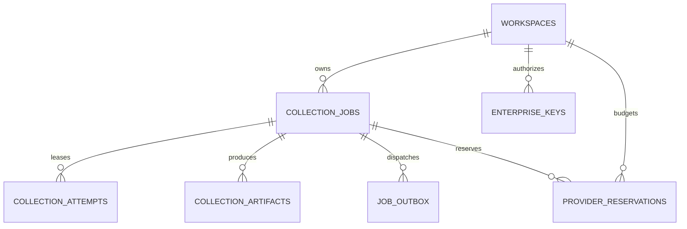

# Native collection: feature coverage and application integration

9 September 2026. Audited `origin/main` at `5e84451a2afb74ff27063c344f1934a123b91b64`. These application additions are branch changes, not a production deployment.

## Finding

The repository already contains the native collection capabilities summarized below. The Axio-CRED adapter previously ran only a depth-one query, returned at most 20 listings, offered no geographic or email-collection options, and discarded several native business fields during normalization. Replacing the native collector with Outscraper would not fix that integration gap.

`/collections` is the native collection workspace. The journey is: configure searches → collect → inspect evidence → select owned/competitor businesses → assess reviews and prepare a human-submitted report. Broad discovery itself does not automatically subscribe every discovered business to a paid monitoring slot.

## Feature matrix

“Inherited” means already on main and executed through the repository collector; it does not mean Google's current responses were verified in this pass.

| Capability | Axio-CRED integration and current status |
|---|---|
| Native browser collection | Inherited Go collector is the primary runtime; no official Places API calls |
| Query inputs, direct place results, custom input IDs | Existing business picker plus batch query form; native `query#!#input-id` convention is retained; normalized input ID is now retained/exported |
| Multiple languages | New language option passed to `-lang`; translated review evidence remains separate from originals |
| Geographic coordinates | Center/zoom form, validation and native flags; existing evidence geography plot. Detailed mode biases location, not a strict radius |
| Grid searches | New bounding-box/cell-size form, backend cell bounds, native grid runner; at most 100 query/cell combinations per local run |
| Fast mode and radius | New fast discovery mode requires center/radius. Emails, extended reviews and grids are rejected in this mode instead of silently ignored |
| Browser page reuse | Inherited. No browser-per-listing reimplementation |
| Browser/context concurrency | New server-only bounded tuning (1–4 per setting), runtime status and native flag forwarding; still one active application job |
| Proxies and authenticated proxies | Server-only proxy-file configuration forwarded to native `-proxies-file`; no credential field or URL in customer responses. HTTP/HTTPS/SOCKS5 support remains native |
| Website email extraction | New opt-in native `-email` collection; existing enrichment workspace and contact export. Contacts remain unverified |
| Reviews | Existing RPC pagination/DOM supplement, full-history action and analysis of collected evidence; batch workspace adds explicit extended-review option. No promise of all reported reviews |
| Broad result quantities | Native deduplication retained; adapter also deduplicates identities. New workspace saves up to 1,000 listings instead of a fixed 20; ordinary business picker remains deliberately bounded |
| Detailed entry fields | Preserve IDs, status, descriptions, address, coordinates, categories, hours, rating distribution, media and service links; business-facts frontend and CSV export |
| Popular times | Now normalized, retained and shown by day/hour. Relative popularity, not visitor counts |
| Payment attributes | Native duplicate-option fix retained; card networks now survive normalization and appear in facts/export |
| Reservations, ordering, menu, listed owner, Street View | Now normalized with safe HTTP(S) links, shown in facts and exported; listed-owner data does not confer ownership authorization |
| Opening-hour/parser fixes | Inherited native code; hours and observed status stay visible in facts |
| JSON and CSV output | Native JSONL capture → normalized JSON export, full business-facts CSV and contact CSV. Spreadsheet formula escaping applied; no raw review text automatically exported to third parties |
| REST/Web jobs | Application POST/status/history/cancel/retry routes and new frontend. Jobs get terminal states after result persistence; repeat runs reuse saved options |
| Completion/inactivity behavior | Native completion detection retained. App adds bounded process lifetime and keeps complete JSONL lines on timeout/nonzero exit, with an explicit partial-run warning |
| Local restart/recovery | Atomic job-file writes, restart-interrupted state, explicit new-run retry. Not automatic continuation of an interrupted native cursor |
| Windows/Docker/runtime/build fixes | Existing build scripts and native code retained. Binary override supports a platform-appropriate binary; Linux deployment and container browser installation still need validation |
| AI agent-guided setup | Upstream operator skill/scripts retained; app offers an explicit guided collection form. No autonomous agent or random sponsor recommendations added to the customer journey |
| PostgreSQL distributed crawling | Upstream implementation retained. App continues using MySQL evidence persistence; PostgreSQL-specific NUL/flush fixes are not MySQL migrations. **Distributed job scheduling is not integrated** |
| SaaS API keys, rate limits, TOTP admin, worker CRUD/status, terminal, provisioning | Separate upstream PostgreSQL/River admin service remains in repo. **Not integrated into the Azure/MySQL app.** Do not expose its administrative terminal through the customer workspace |
| AWS Lambda/S3 and cloud provisioning | Retained upstream, not deployed for Axio-CRED. Azure remains the chosen hosting target; proposed equivalent below |
| LeadsDB bulk export | Upstream writer retained; **no app connector**. Local contact/business exports are available, but are not described as a working LeadsDB integration |
| Custom writer plugins | Upstream operator mechanism retained, not customer-supplied executable uploads. App persists to MySQL through its own adapter |
| Telemetry | Explicitly disabled in the application collector environment; not a missing customer feature |
| Reverts | Preserve the final main behavior. Do not resurrect reverted parsers or removed browser engines |
| Release bumps, sponsor assets, documentation, CI/dependency maintenance | Inherited or retained operator documentation. These are not additional customer features |

The application therefore has broader native collection parity, **not complete parity with the separate native SaaS control plane**. Remaining integrations are explicitly listed above rather than represented by nonfunctional frontend controls.

## Implemented flow and data architecture

- `collection-options.ts` defines a strict input contract. Requests cannot supply arbitrary CLI flags, file paths, credentials, executables or worker concurrency.
- `BusinessDiscovery` is shared by the picker and collection workspace, so they use the same active-job admission gate and provider routing. Broad jobs never call Outscraper. Cancellation does not initiate fallback. Operator configuration/storage errors are not a reason to spend on fallback.
- Native options and query list are saved with each job and resulting dataset. `collection.partial` and `collection.warning` explain truncation/timeouts; successful process exit alone is never a full-review-coverage claim.
- Native job metadata is stored under `.dev/discovery/demo` or `.dev/discovery/mysql`. Unit tests use separate temporary directories. Old unsuffixed job files are left untouched and are not included in the new history; this avoids promoting historical test fixtures into application evidence.
- Existing `intelligence_imports.payload` stores the normalized listing additions. Existing subject/snapshot/review-observation indexes retain their relationships; no parallel business table or schema migration is required for these optional source fields. Older snapshots display “Not collected.”
- The business-facts CSV contains structured complex fields as JSON cells, observation metadata and counts. Full normalized dataset JSON retains review text; the app does not automatically upload exports to a lead vendor.
- Limit: 10 queries, 100 generated query/cell combinations, 1,000 saved listings, one active local job, 20-minute run budget. The saved-listing ceiling bounds publication, not a promise that the native process stops at precisely that number. Native full-history bounds remain in force.
- All new routes inherit the existing production 503 boundary. Local demo mode is not tenant authentication. Collection plans do not enable paid scheduled monitoring.

## Azure equivalent for the remaining control-plane features — proposed, not deployed

Keep the validated collection contract and Go collector, but move process execution out of the web API. Use Azure Container Apps Jobs for native worker containers, MySQL for durable job state, Blob Storage for artifacts and a transactional outbox for dispatch. Avoid running the upstream PostgreSQL/River service alongside MySQL merely to get its admin screens.

Proposed job columns: workspace ID, validated specification JSON, request idempotency key, queued/running/cancel-requested/terminal state, lease owner/expiry, attempt number, progress counters, partial reason and resulting snapshot IDs. Unique `(workspace_id,idempotency_key)` prevents duplicate submissions; attempts must be fenced so an expired worker cannot publish a later result. Provider reservations need unique logical-request keys and atomic allowance checks. Blob artifact rows record content digest, byte size, source and retention expiry.

Enterprise keys must be stored hashed, scoped to a workspace and allowed actions, revocable, rate-limited and audited. Administration should use tenant authorization and provider-managed MFA before worker controls become available. The customer frontend can reuse collection status/history while an operator-only page exposes capacity, failures and retries. Cloud shell access and worker provisioning remain infrastructure-admin operations.

Acceptance gates: cross-tenant denial tests; duplicate dispatch; worker crash/lease expiry; cancellation during an attempt; stale-worker result rejection; atomic publication; recovery after a full allowance reservation; storage retention; Azure runtime/browser validation and sandbox billing. None is implied by the local form or by the presence of upstream source files.

## Local verification

TypeScript, lint, backend/frontend tests and production builds are required. Tests exercise argument construction, invalid geographic/options input, partial JSONL recovery, identity deduplication, cancellation, source-field retention, CSV escaping, broad-job fallback exclusion and production route denial. Browser inspection verifies the collection form and fast/grid mode presentation. Runtime `-h` verifies the installed native binary accepts the exposed flags.

This pass does not establish live Google completeness, proxy-provider connectivity, LeadsDB transmission, paid Outscraper usage, Azure deployment or distributed recovery.
