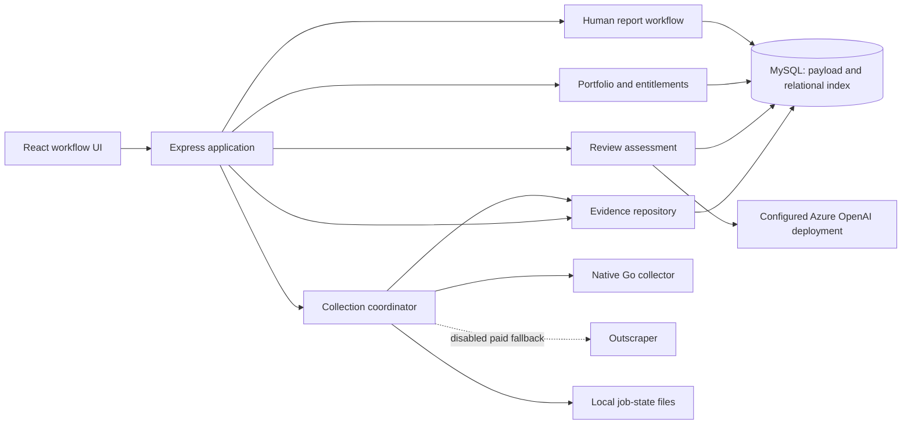
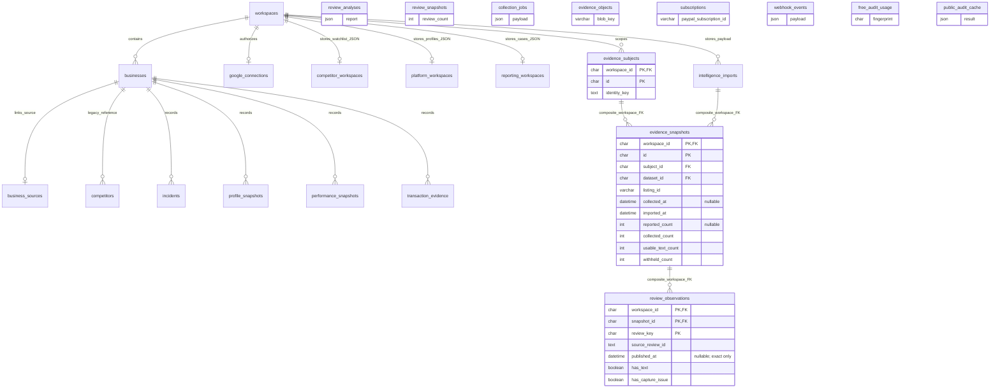
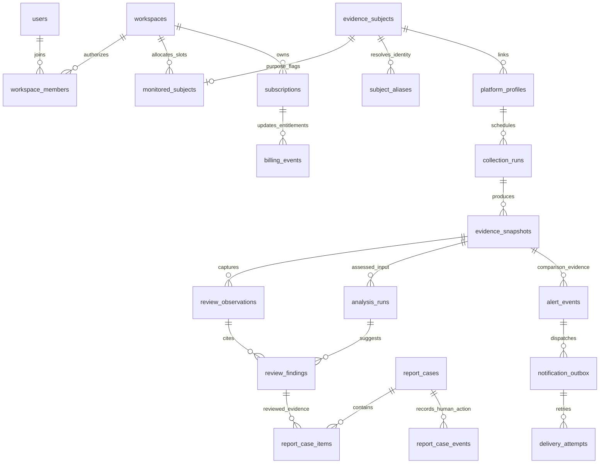

# Axio-CRED: product and architecture baseline

Updated 2026-09-09 against PR #1, including code revision `9bd026b`. The implementation and fixes through `9bd026b` were merged in PR #1 on 9 September 2026. No deployed production release is claimed. Current CI verification uses a disposable MySQL 8 service; earlier local database observations are historical. This is the Axio-CRED product baseline; older plans are requirement history, not proof of delivery.

## Native collection integration follow-up

The [gosom feature audit and native collection architecture](NATIVE-COLLECTION-ARCHITECTURE.md) maps all 297 authored commits to the app. The current branch adds `/collections`, bounded batch/grid/fast discovery, native language/email/history options, partial-result retention, job history/cancel/retry, server-only proxy/concurrency configuration, richer business facts and CSV export. These additions are not yet merged. The upstream PostgreSQL SaaS control plane, LeadsDB connector and cloud provisioners remain distinct from the Azure/MySQL app and are explicitly accounted for in that matrix. Outscraper remains exact-ID fallback only.

## The product objective

**Help a user protect a business and monitor competitors by collecting public evidence, spotting changes, assessing review-policy concerns, and preparing a human-reviewed report.**

The product is an evidence and action workspace. A negative review, a positive review, a burst, an AI score or a shared address does not establish fraud. Reporting is an outcome supported by evidence, not a removal-count promise.

Business ownership is optional for public monitoring. Authorization to manage a Google Business Profile is a separate connection. A workspace can follow a business as owned, competitor, or both; linked Google, Facebook and Trustpilot profiles consume one business slot.

| Plan | Monthly USD | Monitored businesses | Intended checking benefit |
|---|---:|---:|---|
| Free | 0 | One audit; no recurring monitoring slots | One-time audit; public acquisition flow still planned |
| Business | 49 | 1 | Checked twice a day |
| Growth | 149 | 5 | Checked four times a day |
| Enterprise | Custom | Unlimited contractual allowance | Negotiated schedule and collection capacity |

Automatic checking is not running. Unlimited businesses does not mean unlimited concurrent jobs or zero provider cost. The shared `backend/src/product-plan.ts` contract now drives entitlement limits, checkout-price validation and frequency presentation. A local workspace allowance is not evidence of payment.

## One user journey, distinct workspaces

1. **Choose a business.** Enter a Google Place ID, find a listing, or select collected evidence. Choose the user's purpose; do not require business-owner OAuth to monitor a competitor.
2. **Collect.** Show queued/running/completed/partial/failed collection outcomes, collection time and source. A page refresh reloads saved data; it does not collect.
3. **Inspect coverage.** Separate reported total, collected review records, usable text, quarantined text and exact timestamps. A count above the reported total is a discrepancy, not automatically verified completeness.
4. **Assess.** Open the assessment for this exact dataset/listing; distinguish not configured, not assessed, partial assessment, failed assessment and completed findings. Never translate an absent assessment into zero suspected violations.
5. **Verify and act.** Read quotes, alternative explanations and policy mapping. Prepare a report kit only with supporting evidence. A person submits through the relevant platform and records the outcome.
6. **Compare later.** Compare dated snapshots for review activity, rating and public profile changes. Until a scheduler and notification outbox exist, these are observations computed from saved evidence.

| Screen | Primary job | Primary action | Secondary material |
|---|---|---|---|
| Home `/overview` | Prioritize the next useful step | Resolve collection issues, collect, or review assessment | Add another goal, portfolio and latest observations |
| Your businesses `/businesses` | Protect a selected business | Inspect reviews and public profile changes | Optional managed-profile connection |
| Competitors `/competitors` | Investigate a selected competitor | Collect and inspect review evidence | Optional reference-business comparison |
| Evidence `/evidence` | Inspect the precise source snapshot | Assess reviews or open a report kit | Source facts and shared-contact observations |
| Alerts `/alerts` | Review changes between snapshots | Open the underlying evidence | Rule descriptions and delivery readiness |
| Reports `/reports` | Track a person's evidence-review/report work | Prepare, assign, review, record submission | CSV and advanced evidence tools |
| Platforms `/platforms` | Link other profiles to one business | Collect available public structured data | Explicit partial-coverage limits |
| Enrichment `/enrichment` | Inspect discovered business contacts | Export selected contacts with provenance | No contact-verification claim |
| Settings `/settings` | Understand actual allowance and readiness | Configure a relevant connection | Reporting team, data storage, enterprise plans |

Home now leads with per-business next actions. Returning users see the add-business paths in a collapsed disclosure. The legacy `/overview?dataset=...` route redirects to `/evidence` with query parameters preserved, so Home has one meaning. Settings no longer prints raw booleans or a hardcoded Growth subscription. Statuses distinguish available, configured, disabled, limited and planned.

Visual conventions: reuse the existing restrained green/neutral system; reserve warning colors for observed issues; use readable source and date labels; retain keyboard-accessible links, buttons, disclosures and mobile navigation. Do not add another unrelated dashboard theme. The separate owned and competitor review dashboards retain their evidence charts and expandable report kits.

## Findings and improvements delivered in this pass

| Finding | Effect | Implemented correction |
|---|---|---|
| Analysis and report creation searched only the recent import list | Old evidence could become unreachable after 20 unrelated collections | Direct workspace-scoped `getIntelligenceImport(id)` lookup, API route, analysis/report/selection integration, and evidence-page recovery of a requested old dataset |
| Recent imports controlled the available monitoring history | Unrelated collections could erase a business's visible comparison baseline | Recent 20 collections plus the latest two indexed snapshots per monitored identity; full arbitrary history pagination is still future work |
| Reviews existed only inside large JSON payloads | No database-level observation relationships or indexed coverage | Additive subject → snapshot → review-observation projection with composite workspace foreign keys |
| Saving JSON and a future index independently would drift | Partial writes could leave contradictory evidence | Payload and projection now commit in one transaction; backfill is restartable per dataset |
| Null observation data could be confused with healthy/complete defaults | Overview API exposed unsupported 100% aggregate coverage and zero-filled trends | MySQL overview now returns unknown aggregate integrity/coverage and an empty unsupported trend; no invented last-check time |
| Settings assumed Growth regardless of current workspace | Incorrect allowance presentation and unclear connection state | Uses live overview allowance, separates checkout choice from current plan, exposes AI model configuration and disabled fallback |
| Home treated returning users like first-time setup | Important data-quality actions were buried | Per-business priorities place missing collections and quarantined review text ahead of evidence assessment |

No saved source collection, existing business, review analysis or report case was deleted. Historical review text quarantined in an earlier collector correction remains quarantined; this architecture pass does not recover missing text or run a new AI assessment.

## Backend architecture

Keep a modular monolith for the MVP. Express coordinates the React app, MySQL persistence, the Go collector, assessment providers and report workflows. Extract modules by responsibility before introducing services. The upstream Go scraper's PostgreSQL/River server is separate from this application's MySQL coordinator; adopting it would require an explicit integration design, not another parallel queue.



The source payload remains authoritative for captured review text. The relational projection supports identity, coverage and history retrieval; it is not a second, editable copy of the review content. Analysis results reference the source dataset and input hash. A projection row or SHA-256 digest proves neither the authenticity of a review nor that a customer transaction occurred.

For Azure production, retain Azure Database for MySQL, place original artifacts in Blob Storage, keep secrets in Key Vault, and run the API separately from bounded collector workers. Use one durable job queue/coordinator and a transactional notification outbox. Choose MySQL jobs or a Service Bus-backed dispatcher as the queue authority, not two independent schedulers. Azure Container Apps is a candidate deployment target; no cloud deployment was performed here. [Azure Database for MySQL overview](https://learn.microsoft.com/en-us/azure/mysql/flexible-server/overview).

## Database assessment and ER diagrams

The audited local schema originally had 21 tables. It now has 24 after the additive evidence index. No existing Mermaid ER diagram was found in `app` or `.azure`; diagrams below are derived from source DDL and inspected foreign-key metadata.

The main remaining weakness is split business identity: `businesses` and `business_sources` represent owned records; the active competitor list is JSON in `competitor_workspaces`; linked platforms and reporting teams/cases are other workspace JSON documents. The older `competitors` table remains a legacy path. Several legacy tables have only a business FK, or no FK at all. The new composite keys improve the evidence path; they do not repair every legacy relationship or provide application authentication. MySQL requires appropriate indexes and compatible column definitions for foreign keys. [MySQL 8 foreign-key documentation](https://dev.mysql.com/doc/refman/8.0/en/create-table-foreign-keys.html).

### Current physical relationships after this change

Lines below represent declared foreign keys, not an assertion that every table is the active source of its named workflow. Standalone tables are intentional: their references are not currently enforced by FKs.



`evidence_subjects.id` hashes the identity key within a workspace. Google Place IDs take precedence, then CID; unresolved imports use dataset/listing identity so two equal names do not merge. Alias resolution for a Place ID/CID pair or a moved listing is not implemented. `review_observations` stores source review IDs, metadata and text-presence flags; the original text remains in the parent JSON payload. A unique source review ID is an observation identity, not proof of a unique person.

### Target relational workflow — proposed, not migrated



Every tenant-owned relationship in this target needs a composite workspace FK and authorization on the API path. `monitored_subjects` should permit both owned and competitor purpose flags on one row, rather than charging two slots. Preserve source-specific IDs, provider provenance, exact timestamps and historical versions. Account deletion and retention need an explicit policy covering raw payloads, reviewer data, source files and backups.

## Complete capability reconciliation

| Requested capability | Current state | Remaining work / boundary |
|---|---|---|
| Native public Google discovery and Place ID entry | Local implementation | Reliability varies; no full-review guarantee; no official Places calls |
| Extended review history and rich metadata | Local, partial coverage | Validate collection errors and missing timestamps; current native cap is 5,000 reviews/job |
| Outscraper fallback | Implemented, disabled | Paid calls remain disabled; monthly allowance zero; do not activate implicitly |
| Own and competitor dashboards, review list and charts | Local implementation | Data-dependent history; distinguish sampled averages from reported rating |
| AI review-policy and pattern analysis | Configured, local workflow | Assessments must actually run; new large collections are not automatically assessed |
| Expandable report kit, locator and case queue | Local human-assisted workflow | No automatic Google reporting endpoint integrated |
| Auto-add coming soon / up to 20 reporting accounts | Placeholder / local authorized team workflow | No account-rotation or coordinated automated complaint service |
| Low-rating, burst, rating-drop and profile-change observations | Local comparisons | Persist alert events and deduplicate across runs before unattended delivery |
| Twice/four-times-daily checks | Plan contract only | Durable scheduler, leases, retries and rate/budget control |
| In-app, email and Meta WhatsApp notifications | In-app derived observations; external delivery missing | Persistent inbox, delivery outbox, verified recipients, consent and templates |
| Facebook and Trustpilot in the same slot | Linked profiles and limited public structured-data collection | Validate profile coverage; not a complete review-history provider |
| Separate lead enrichment | Local discovered-contact view and export | No verified email claim, no Whitepages/WhatsApp presence enrichment implemented |
| Spam network map/shared contacts and redressal CSV | Observations and CSV exist | No verified fake-address database, actual local-pack position or automatic redressal submission |
| Pin, category, phone, status integrity | Public comparison / snapshot utilities | Continuous protected-profile monitoring and authorized corrective edits not delivered |
| SAB unmasking detection and auto-rehide | Not operational | Needs authoritative business-state/public-state comparison, authorization and conflict-safe repair |
| Own photos, removed media and public Q&A | Incomplete / not operational as a monitor | Provider/surface validation and repeated comparable captures needed |
| Reviewer history/pods, full competitor text, LSA fraud | Limited observed signals | Cannot infer uncollected account histories, network membership or fraud from names alone |
| Review requests without gating | Not delivered | Build a neutral request flow with equal routes; do not market it as compliance certification |
| Transaction evidence / CRM vault | Local hash primitive | CRM connectors, provenance, retention and access controls; a hash does not defeat a legal claim |
| Extortion/legal/escalation evidence workflow | Manual evidence groundwork | Dedicated case routing/templates and qualified review; no guaranteed restoration or priority removal |
| Free audit acquisition flow | Planned, with prototype primitives | Public quota/abuse controls, conversion flow and reliable budget accounting |
| PayPal subscriptions | Client/plan setup and verification logic; checkout blocked | Webhook ID absent locally; authenticated subscription ownership and lifecycle entitlement changes need completion |
| Enterprise API and signed outbound webhooks | Local API prototype | Tenant keys/scopes, quotas, idempotency, signatures, delivery logs and versioned API |
| Azure SaaS hosting and MySQL | Local MySQL works; Azure configuration pieces exist | Auth, worker, migration/deploy, backups, observability and recovery verification |

The supplied threat assessment is treated as product input, not as verified evidence that each described exploit, legal assertion or claimed competitor feature exists. The product should not promise automatic reinstatement, legally conclusive proof, exact local ranking, or guaranteed removal.

## Release order and acceptance gates

1. **Evidence reliability:** repair collector edge cases, retain raw provenance, resolve the current quarantined text, then validate analysis on a known usable sample and a complete collected batch. Coverage must remain visible end to end.
2. **Tenant and billing boundary:** real login, workspace membership and role checks on every route; subscription owner binding and verified idempotent PayPal lifecycle processing. Test a second tenant and a lower-privilege user across all routes, not just the new evidence repository.
3. **Durable operation:** one worker authority, persistent runs/leases, retry/backoff and per-workspace budgets; scheduled twice/four-times-daily checks; deduplicated alerts and email/Meta WhatsApp outbox.
4. **Relational consolidation:** backfill aliases, monitoring purpose, platform profiles, analyses/findings and cases into the target model. Validate old/new reads, switch the authoritative write path, then retire legacy JSON paths only after reconciliation and backup. Do not build a second competing watchlist.
5. **Azure test deployment:** private staging, scoped managed identities, secrets, backups, migration rehearsal, service monitoring and restore test. Then PayPal sandbox and delivery-provider tests with authorized test recipients.
6. **Public acquisition and enterprise:** metered free audit, tenant API, signed webhooks and higher-capacity workers after the core path passes.

## Verification and operation

From `app`:

```powershell
npm run migrate -w backend
node --import tsx scripts/verify-evidence-index.mjs
npm test
npm run build
```

Migration takes a MySQL advisory lock, creates additive tables/indexes, and backfills each source dataset transactionally. MySQL DDL is not wrapped in an all-or-nothing migration transaction. Re-running the migration rebuilds the projection; original payloads are untouched. Deploy schema before restarting an API build that expects it. For application rollback, leave the additive tables in place and restore the previous application build; no destructive down migration is required.

The isolated SQL verification creates temporary synthetic workspaces, checks direct lookup and FK isolation, verifies retained history after 21 unrelated imports, retries indexing and checks failed-write rollback, then removes only those test workspaces. It makes no provider calls. Live UI checks and exact test totals are recorded in `ARCHITECTURE-VALIDATION.md`.

## PR review fixes (9 September 2026)

- Production customer API access now fails closed with HTTP 503 until tenant authorization exists. Only health and readiness API routes remain available. This includes OAuth and billing; setting provider credentials does not unlock a public SaaS. Local development remains available.
- PayPal event insertion, subscription/entitlement updates and the processed timestamp commit in one transaction. A database failure rolls everything back so the provider can retry; concurrent duplicate deliveries commit once. Subscription ownership and lifecycle handling remain separate release gates.
- Migrations and runtime use the same MySQL connection builder. Azure hosts always use certificate and hostname verification with TLS 1.2 or later. `ssl-mode=REQUIRED` is translated into driver options; insecure or embedded SSL overrides are rejected. Local MySQL URLs without TLS options retain local behavior.
- Fallback admission distinguishes a disabled provider from exhausted new-request budget. An already-reserved pending request can resume when the native collector is unavailable; only the provider ledger may authorize a new charge. Paid fallback remains disabled by default.
